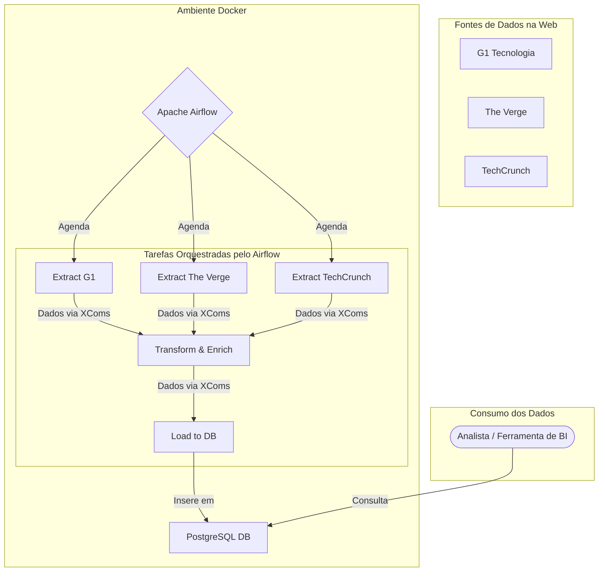

# Pipeline de ETL de Notícias de Tecnologia com Airflow e Docker

Este projeto implementa um pipeline de ETL (Extração, Transformação e Carga) automatizado e idempotente para coletar notícias de tecnologia de múltiplas fontes, processá-las e armazená-las em um banco de dados PostgreSQL. O ambiente é 100% containerizado com Docker e orquestrado pelo Apache Airflow.

## O Problema de Negócio (O "Porquê")

Uma startup de tecnologia precisa se manter atualizada sobre o cenário competitivo e as últimas tendências. A equipe de estratégia depende de notícias de portais de tecnologia para tomar decisões, mas o processo de coletar, ler e organizar essas informações manualmente é lento, propenso a erros e consome horas preciosas.

A solução é um pipeline de dados automatizado que centraliza as notícias mais relevantes de fontes-chave em um banco de dados estruturado, pronto para análise e geração de insights.

## Arquitetura da Solução

O fluxo de dados foi projetado para ser robusto e resiliente. A comunicação entre as tarefas do Airflow é feita via **XComs**, o sistema de mensagens interno do Airflow, eliminando a dependência de arquivos em disco e prevenindo problemas de estado entre as execuções.



## Stack de Tecnologias

* **Orquestração de Pipeline:** Apache Airflow
* **Containerização:** Docker & Docker Compose
* **Banco de Dados:** PostgreSQL
* **Linguagem Principal:** Python 3.8
* **Extração de Dados (Web Scraping):**
    * **BeautifulSoup4 & Requests:** Para parsing de HTML e requisições HTTP.
* **Transformação e Análise:**
    * **Pandas:** Para manipulação e limpeza de dados em memória.
    * **spaCy:** Para Processamento de Linguagem Natural (NLP), especificamente para Reconhecimento de Entidades Nomeadas (extração de nomes de empresas dos títulos).
* **Comunicação entre Tarefas:** Airflow XComs

## Estrutura do Projeto

```
pipeline_noticias_tech/
├── dags/             # Contém o arquivo Python da nossa DAG principal.
├── logs/             # Armazena os logs gerados pelo Airflow (ignorado pelo Git).
├── plugins/          # Para plugins customizados do Airflow (vazio neste projeto).
├── scripts/          # Contém toda a nossa lógica de negócio (ETL).
│   ├── extract_g1.py
│   ├── extract_verge.py
│   ├── extract_techcrunch.py
│   ├── transform.py
│   └── load.py
├── .gitignore        # Especifica arquivos e pastas a serem ignorados pelo Git.
├── Dockerfile        # Receita para construir nossa imagem Docker customizada.
└── docker-compose.yml # Plano mestre para orquestrar todos os nossos serviços.
```

## Como Executar o Ambiente Localmente

Siga os passos abaixo para construir e iniciar o ambiente completo na sua máquina.

### Pré-requisitos
* [Docker](https://www.docker.com/get-started)
* [Docker Compose](https://docs.docker.com/compose/install/)
* [Git](https://git-scm.com/downloads)

### Passos para a Instalação

1.  **Clone o Repositório:**
    ```bash
    git clone [https://github.com/Felipe-teodoro05/pipeline-ETL-Airflow.git](https://github.com/Felipe-teodoro05/pipeline-ETL-Airflow.git)
    cd pipeline-ETL-Airflow
    ```

2.  **Construa e Inicie os Serviços:**
    Este comando irá ler o `Dockerfile` para construir a imagem customizada do Airflow e depois iniciará todos os serviços. A primeira execução pode levar vários minutos.
    ```bash
    docker compose up --build -d
    ```

3.  **Aguarde a Inicialização:**
    O processo de inicialização é automático. O serviço `airflow-init` irá preparar o banco de dados e criar o usuário administrador. Este serviço irá rodar e parar, o que é o comportamento esperado. Aguarde cerca de 2-3 minutos para que os outros serviços fiquem estáveis.

4.  **Verifique se os Containers estão Ativos:**
    Rode `docker ps`. Você deve ver 3 containers com o status "Up" ou "healthy": `postgres_db_noticias`, `airflow_webserver_noticias`, e `airflow_scheduler_noticias`.

### Como Usar o Pipeline

1.  **Acesse a Interface do Airflow:**
    * Abra seu navegador e acesse: `http://localhost:8080`

2.  **Faça o Login:**
    * **Usuário:** `admin`
    * **Senha:** `admin`

3.  **Execute o Pipeline:**
    * Encontre a DAG `mercado_tech_etl_pipeline`, ative-a no botão de toggle.
    * Para uma **carga histórica inicial** (ex: 10 páginas), clique no botão Play (▶️), selecione **"Trigger DAG w/ config"** e ajuste os parâmetros `num_pages_to_scrape` e `truncate_table`.
    * Para simular uma **execução diária normal**, apenas clique em "Trigger DAG", e ele usará os valores padrão (1 página, sem truncar a tabela).

4.  **Acesse o Banco de Dados:**
    * Conecte-se ao banco de dados PostgreSQL na porta `5432` do seu `localhost`.
    * **Credenciais:** Usuário: `airflow`, Senha: `airflow`, Banco: `airflow`.

## Próximos Passos e Melhorias

Este projeto estabelece uma base sólida que pode ser expandida com funcionalidades mais avançadas, como:
* [ ] **Qualidade de Dados:** Implementar um passo de validação com [Great Expectations](https://greatexpectations.io/) para garantir a integridade dos dados.
* [ ] **Notificações:** Configurar a DAG para enviar alertas via E-mail ou Slack em caso de falhas.
* [ ] **Dashboard de BI:** Conectar uma ferramenta como Metabase ou Power BI ao PostgreSQL para criar visualizações e dashboards com os dados coletados.