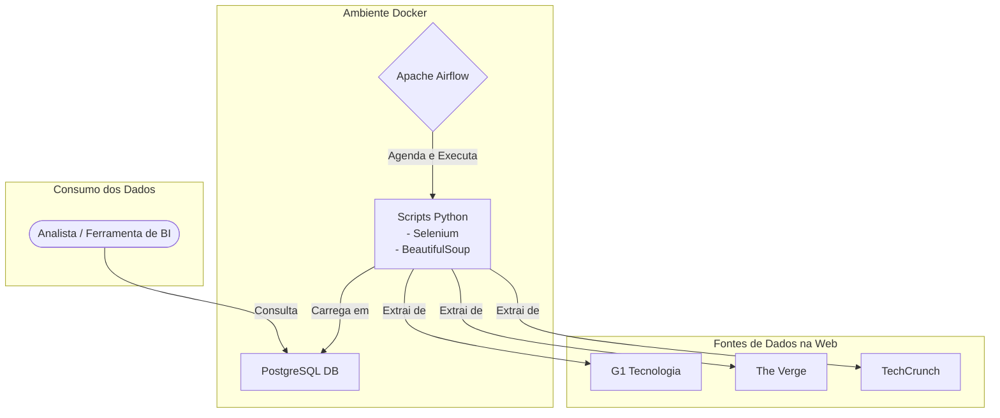

# Pipeline de ETL de Notícias de Tecnologia com Airflow e Docker

Este projeto implementa um pipeline de ETL (Extração, Transformação e Carga) automatizado para coletar notícias de tecnologia de múltiplas fontes, processá-las e armazená-las em um banco de dados PostgreSQL. O ambiente é 100% containerizado com Docker e orquestrado pelo Apache Airflow.

## O Problema de Negócio (O "Porquê")

Uma startup de tecnologia precisa se manter atualizada sobre o cenário competitivo e as últimas tendências. A equipe de estratégia depende de notícias de portais de tecnologia para tomar decisões, mas o processo de coletar, ler e organizar essas informações manualmente é lento, propenso a erros e consome horas preciosas.

A solução é um pipeline de dados automatizado que centraliza as notícias mais relevantes de fontes-chave em um banco de dados estruturado, pronto para análise.

## Arquitetura da Solução

O fluxo de dados foi projetado para ser robusto e escalável, utilizando ferramentas padrão da indústria de engenharia de dados. O Selenium foi incorporado para lidar com sites que carregam conteúdo dinamicamente via JavaScript.



## Stack de Tecnologias

* **Orquestração de Pipeline:** Apache Airflow
* **Containerização:** Docker & Docker Compose
* **Banco de Dados:** PostgreSQL
* **Linguagem Principal:** Python 3.8
* **Extração de Dados (Web Scraping):**
    * **Selenium:** Para automação de navegador e renderização de conteúdo dinâmico (JavaScript).
    * **BeautifulSoup4:** Para parsing do conteúdo HTML.
    * **Requests:** Para fazer requisições HTTP (para sites estáticos).
* **Manipulação de Dados:** Pandas (a ser utilizado na fase de transformação).

## Estrutura do Projeto

```
pipeline_noticias_tech/
├── dags/             # Onde os arquivos Python das DAGs do Airflow são armazenados.
├── logs/             # Logs gerados pelos containers do Airflow.
├── plugins/          # Plugins customizados do Airflow (não utilizado neste projeto).
├── scripts/          # Nossos scripts de ETL (extração, transformação, carga).
│   ├── temp_data/    # Armazena os arquivos JSON temporários gerados pela extração.
│   └── *.py          # Scripts de extração (ex: extract_g1.py).
├── .gitignore        # Especifica arquivos e pastas a serem ignorados pelo Git.
├── Dockerfile        # Receita para construir nossa imagem Docker customizada (Airflow + Chrome + Selenium).
└── docker-compose.yml # Plano mestre para orquestrar todos os nossos serviços (containers).
```

## Como Executar o Ambiente Localmente

Siga os passos abaixo para construir e iniciar o ambiente completo na sua máquina.

### Pré-requisitos
* [Docker](https://www.docker.com/get-started)
* [Docker Compose](https://docs.docker.com/compose/install/) (geralmente já vem com o Docker Desktop)
* [Git](https://git-scm.com/downloads)

### Passos para a Instalação

1.  **Clone o Repositório:**
    ```bash
    git clone [https://github.com/seu-usuario/pipeline_noticias_tech.git](https://github.com/seu-usuario/pipeline_noticias_tech.git)
    cd pipeline_noticias_tech
    ```

2.  **Construa e Inicie os Serviços:**
    Este comando irá ler o `Dockerfile` para construir a imagem customizada do Airflow (com Chrome e Selenium) e depois iniciará todos os serviços definidos no `docker-compose.yml`. A primeira execução pode levar vários minutos.
    ```bash
    docker compose up --build -d
    ```

3.  **Aguarde a Inicialização:**
    O processo de inicialização é automático. O serviço `airflow-init` irá preparar o banco de dados e criar o usuário administrador padrão. Este serviço irá rodar e parar, o que é o comportamento esperado. Aguarde cerca de 2-3 minutos para que o `webserver` e o `scheduler` fiquem estáveis.

4.  **Verifique se os Containers estão Ativos:**
    Rode o comando `docker ps`. Você deve ver 3 containers com o status "Up" ou "healthy": `postgres_db_noticias`, `airflow_webserver_noticias`, e `airflow_scheduler_noticias`.

### Como Usar

1.  **Acesse a Interface do Airflow:**
    * Abra seu navegador e acesse: `http://localhost:8080`

2.  **Faça o Login:**
    * **Usuário:** `admin`
    * **Senha:** `admin`

3.  **Execute os Pipelines:**
    * Na interface, encontre a DAG desejada (ex: `mercado_tech_etl_dag`), ative-a no botão de toggle e dispare uma execução manual clicando no botão "Play".

4.  **Acesse o Banco de Dados:**
    * Você pode se conectar ao banco de dados PostgreSQL usando sua ferramenta de BI ou cliente SQL preferido na porta `5432` do seu `localhost`.
    * **Credenciais do DB:** Usuário: `airflow`, Senha: `airflow`, Banco: `airflow`.

## Próximos Passos e Melhorias

Este projeto estabelece uma base sólida que pode ser expandida com funcionalidades mais avançadas, como:
* [ ] **Qualidade de Dados:** Implementar um passo de validação com [Great Expectations](https://greatexpectations.io/) após a transformação para garantir a integridade dos dados antes da carga.
* [ ] **Notificações:** Configurar a DAG para enviar alertas via E-mail ou Slack em caso de falhas.
* [ ] **Dashboard de BI:** Conectar uma ferramenta como Metabase ou Power BI ao PostgreSQL para criar visualizações e dashboards com os dados coletados.
* [ ] **Refatoração:** Modularizar ainda mais os scripts de extração e transformação para facilitar a adição de novas fontes de dados.