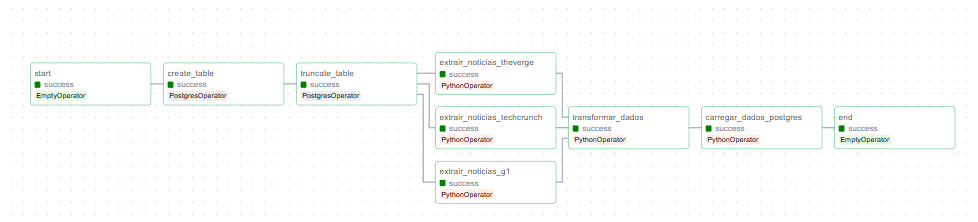

# TechPulse: Automated Market Intelligence Pipeline

   

## Business Problem (O Desafio)
No mercado de tecnologia, a latência da informação é um risco competitivo. Processos manuais de monitoramento de tendências são lentos, não escaláveis e propensos a viés humano.

**O Objetivo:** Engenhar uma solução de *Market Intelligence* autônoma que monitore, extraia e estruture dados de múltiplos players globais (TechCrunch, The Verge, G1) em tempo real. O sistema deve garantir **alta disponibilidade**, **idempotência** e entregar dados enriquecidos com NLP (Processamento de Linguagem Natural) para o time de estratégia.

---

## Architecture & Engineering

A arquitetura foi desenhada seguindo os princípios de **Microserviços** e **Isolamento de Recursos**. O ambiente é 100% containerizado, garantindo reprodutibilidade imediata em qualquer Cloud (AWS/GCP) ou ambiente local.


### Decisões Técnicas de Engenharia

- **Orquestração com Airflow:** escolhido para gerenciar dependências complexas e permitir *backfilling* (recuperação de dados históricos) e *retries* automáticos em caso de falha dos sites fonte.
- **XComs vs. S3:** para este escopo (dados textuais leves), utilizou-se XComs para passagem de mensagens entre tarefas visando simplicidade da infraestrutura. Nota: para escala de Big Data, o design é adaptável para *staging* em S3/MinIO.
- **Estratégia de carga (Upsert):** implementação de lógica para evitar duplicidade de notícias no banco de dados, garantindo a integridade da *Single Source of Truth*.


## Tech Stack

| Componente | Tecnologia | Função |
|---|---|---|
| Orchestrator | Apache Airflow 2.x | Gerenciamento de DAGs e monitoramento |
| Container | Docker & Compose | Isolamento de ambiente e deploy simplificado |
| Database | PostgreSQL | Data warehouse transacional |
| Ingestion | Python (Requests/BS4) | Extração de dados de fontes dinâmicas |
| Analytics/NLP | SpaCy & Pandas | NER (Named Entity Recognition) para identificar empresas citadas |

## DAG


## Estrutura do Projeto

```
pipeline_noticias_tech/
├── dags/             # Contém o arquivo Python da nossa DAG principal.
├── logs/             # Armazena os logs gerados pelo Airflow (ignorado pelo Git).
├── plugins/          # Para plugins customizados do Airflow (vazio neste projeto).
├── scripts/          # Contém toda a nossa lógica de negócio (ETL).
│   ├── extract_g1.py
│   ├── extract_verge.py
│   ├── extract_techcrunch.py
│   ├── transform.py
│   └── load.py
├── .gitignore        # Especifica arquivos e pastas a serem ignorados pelo Git.
├── Dockerfile        # Receita para construir nossa imagem Docker customizada.
└── docker-compose.yml # Plano mestre para orquestrar todos os nossos serviços.
```

## How to Run (Deploy Local)

Siga os passos abaixo para construir e iniciar o ambiente completo na sua máquina.

### Pré-requisitos
* [Docker](https://www.docker.com/get-started)
* [Docker Compose](https://docs.docker.com/compose/install/)
* [Git](https://git-scm.com/downloads)

### Passos para a Instalação

1.  **Clone o Repositório:**
    ```bash
    git clone [https://github.com/Felipe-teodoro05/pipeline-ETL-Airflow.git](https://github.com/Felipe-teodoro05/pipeline-ETL-Airflow.git)
    cd pipeline-ETL-Airflow
    ```

2.  **Construa e Inicie os Serviços:**
    Este comando irá ler o `Dockerfile` para construir a imagem customizada do Airflow e depois iniciará todos os serviços. A primeira execução pode levar vários minutos.
    ```bash
    docker compose up --build -d
    ```

3.  **Aguarde a Inicialização:**
    O processo de inicialização é automático. O serviço `airflow-init` irá preparar o banco de dados e criar o usuário administrador. Este serviço irá rodar e parar, o que é o comportamento esperado. Aguarde cerca de 2-3 minutos para que os outros serviços fiquem estáveis.

4.  **Verifique se os Containers estão Ativos:**
    Rode `docker ps`. Você deve ver 3 containers com o status "Up" ou "healthy": `postgres_db_noticias`, `airflow_webserver_noticias`, e `airflow_scheduler_noticias`.

### Como Usar o Pipeline

1.  **Acesse a Interface do Airflow:**
    * Abra seu navegador e acesse: `http://localhost:8080`

2.  **Faça o Login:**
    * **Usuário:** `admin`
    * **Senha:** `admin`

3.  **Execute o Pipeline:**
    * Encontre a DAG `mercado_tech_etl_pipeline`, ative-a no botão de toggle.
    * Para uma **carga histórica inicial** (ex: 10 páginas), clique no botão Play, selecione **"Trigger DAG w/ config"** e ajuste os parâmetros `num_pages_to_scrape` e `truncate_table`.
    * Para simular uma **execução diária normal**, apenas clique em "Trigger DAG", e ele usará os valores padrão (1 página, sem truncar a tabela).

4.  **Acesse o Banco de Dados:**
    * Conecte-se ao banco de dados PostgreSQL na porta `5432` do seu `localhost`.
    * **Credenciais:** Usuário: `airflow`, Senha: `airflow`, Banco: `airflow`.

## Próximos Passos e Melhorias

Este projeto estabelece uma base sólida que pode ser expandida com funcionalidades mais avançadas, como:
* [ ] **Qualidade de Dados:** Implementar um passo de validação com [Great Expectations](https://greatexpectations.io/) para garantir a integridade dos dados.
* [ ] **Notificações:** Configurar a DAG para enviar alertas via E-mail ou Slack em caso de falhas.
* [ ] **Dashboard de BI:** Conectar uma ferramenta como Metabase ou Power BI ao PostgreSQL para criar visualizações e dashboards com os dados coletados.